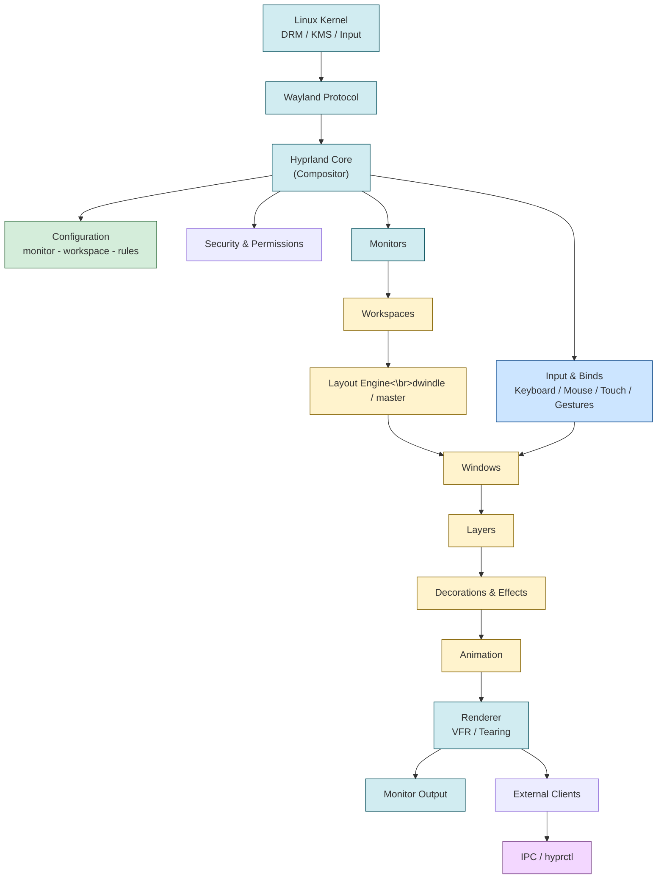

### What is this page?

This is my workflow of studying the Hyprland functionality.

### Cheat Sheet

```mermaid
flowchart TD
    %% Core stack
    Kernel["Linux Kernel</br>DRM / KMS / Input"]:::cyan
    Wayland["Wayland Protocol"]:::cyan
    Core["Hyprland Core</br>(Compositor)"]:::cyan

    %% Parallel subsystems
    Input["Input & Binds</br>Keyboard / Mouse / Touch / Gestures"]:::blue
    Config["Configuration</br>monitor - workspace - rules"]:::green
    Security["Security & Permissions"]:::red

    Monitors["Monitors"]:::cyan
    Workspaces["Workspaces"]:::yellow
    Layout["Layout Engine<\br>dwindle / master"]:::yellow
    Windows["Windows"]:::yellow
    Layers["Layers"]:::yellow
    Decor["Decorations & Effects"]:::yellow
    Anim["Animation"]:::yellow
    Renderer["Renderer</br>VFR / Tearing"]:::cyan
    Output["Monitor Output"]:::cyan
    External["External Clients"]:::megenta
    IPC["IPC / hyprctl"]:::magenta

    Kernel --> Wayland --> Core

    Core --> Monitors --> Workspaces --> Layout --> Windows --> Layers --> Decor --> Anim --> Renderer --> Output

    Core --> Input --> Windows
    Core --> Config
    Core --> Security
    Renderer --> External --> IPC

    classDef blue fill:#cce5ff, stroke:#004085
    classDef green fill:#d4edda, stroke:#155724
    classDef yellow fill:#fff3cd, stroke:#856404
    classDef cyan fill:#d1ecf1, stroke:#0c5460
    classDef magenta fill:#f3d7ff, stroke:#5a1a6a
```
